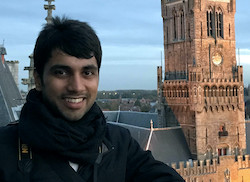

# Research Project: Augmenting Social Media Content Moderation

Around the world, users of social media platforms generate millions of comments, videos, and photos per day. Decisions about whether to remove content, whether it's as benign as an off-topic comment or as dangerous as self-harm or abuse videos, are often made by humans, often called "moderators". 

This research project, a collaboration among researchers at the [New Jersey Institute of Technology](https://people.njit.edu/faculty/wohn), [UCLA](https://gseis.ucla.edu/directory/sarah-roberts/), and the [University of Michigan](https://www.si.umich.edu/people/libby-hemphill), will improve moderators' quality of life, augment their capabilities, and help society understand how moderation decisions are made and how to support the workers who help keep the internet open and enjoyable. These advances will enable moderation efforts to keep pace with user-generated content and ensure that problematic content does not overwhelm internet users. The project includes outreach and engagement activities with academic, industry, policy-makers, and the public that ensure the project's findings and tools support broad stakeholders impacted by user-generated content and its moderation. We're funded by the [National Science Foundation](https://nsf.gov/awardsearch/showAward?AWD_ID=1928434&HistoricalAwards=false).

## Survey of Moderators Who Quit

You are invited to participate in a study about your experiences as a moderator for subreddits or Facebook Groups. This study is facilitated by a group of researchers at the [University of Michigan School of Information](https://www.si.umich.edu/), many of us current and former subreddit or Facebook Group moderators ourselves. We hope that learning more about your experiences will help us as a research team and community of moderators develop ways to better support each other in our work.

Have you quit moderating a Facebook group or subreddit? We'd love to hear about your experiences: [https://umich.qualtrics.com/jfe/form/SV_428JWYY2NU1se5n](https://umich.qualtrics.com/jfe/form/SV_428JWYY2NU1se5n)

# UMSI Research Team

## Libby Hemphill, PhD

Dr. Hemphill is the faculty lead at UMSI. She studies ways to use computation and human intervention to make online discussions more inclusive and productive. She can be reached at [libbyh@umich.edu](mailto:libbyh@umich.edu).

## Angela Schöpke Gonzalez
[https://www.angelaschopke.com/](https://www.angelaschopke.com/)

Angela M. Schöpke Gonzalez is a dance theater artist, writer, computational scientist, and curator. Her work draws inspiration from deep investigations of history, body, and infrastructural systems like policy and algorithms. Her current projects investigate how to address traumatization associated with the emotional labor of digital content moderation work, the consequences of technologized international borders on migrating human bodies, how to make space for the body's knowledge in academic and economic spaces which tend to value text, and emotional uncertainty with her forthcoming dance film Skeleton and Me. She is currently pursuing a PhD at the University of Michigan School of Information.

## Shubham Atreja

Shubham Atreja is a PhD student at the School of Information, University of Michigan. He is interested in evaluating and improving online socio-technical systems. His current research investigates ways to support the work of online content moderators, and how to engage the public in fighting misinformation online. Previously, he worked at IBM Research Labs in India, building systems and analyzing natural language data to facilitate technical support.

## Han Na Shin

[https://iamhannashin.com](https://iamhannashin.com)

Han Na (Hanna) Shin and a second-year PhD student at the University of Michigan School of Information (UMSI). She is co-advised by Dr. Cliff Lampe and Dr. Libby Hemphill, and a member of the Social Media Research Lab (SMRL).